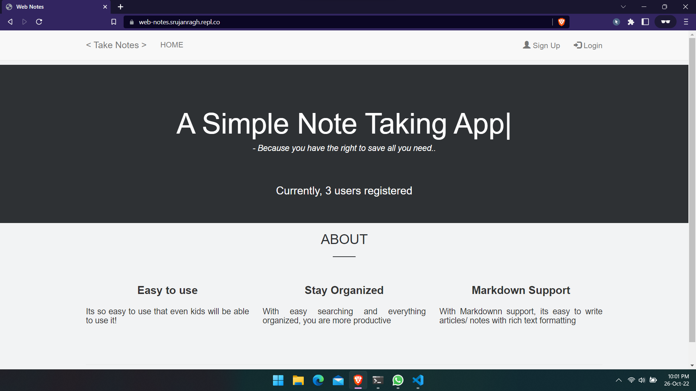
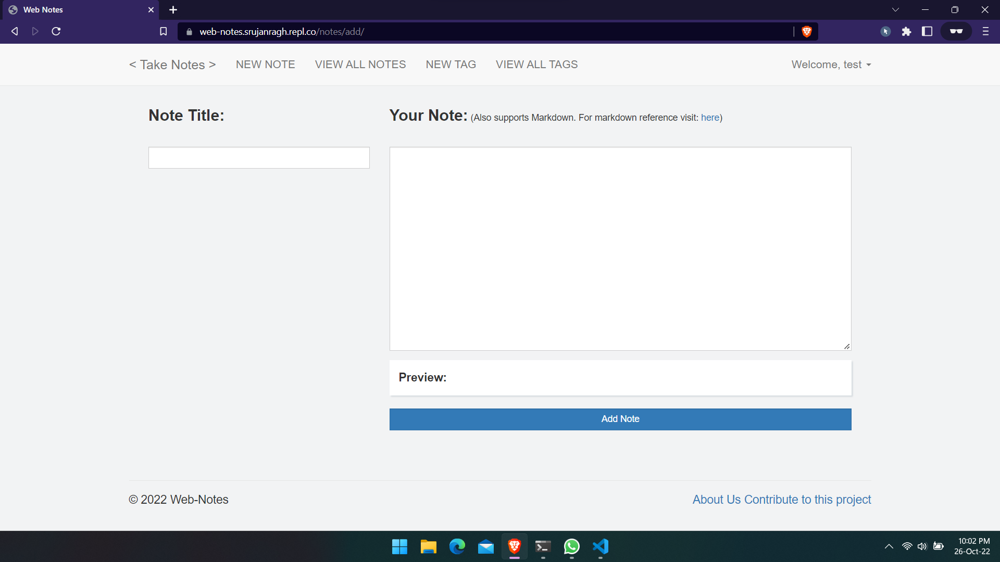
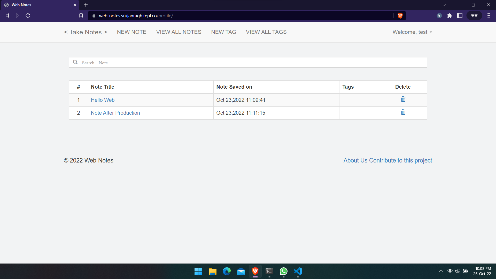
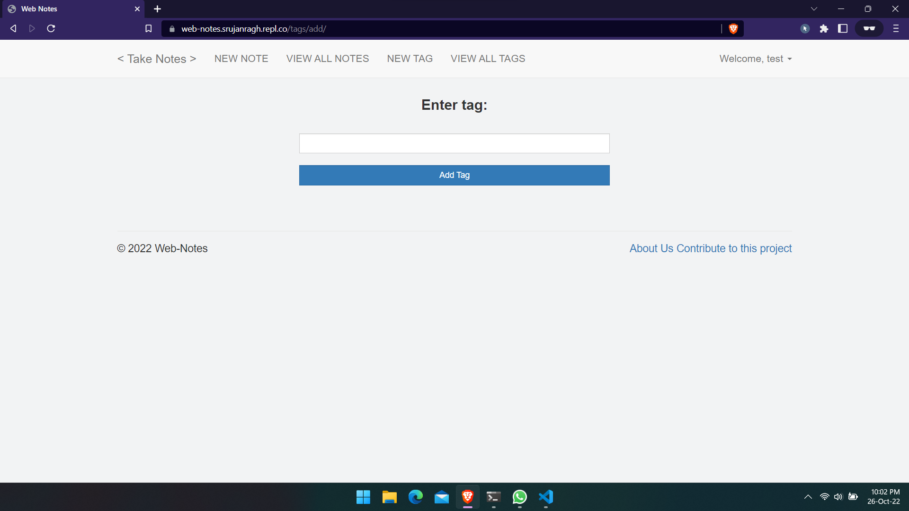
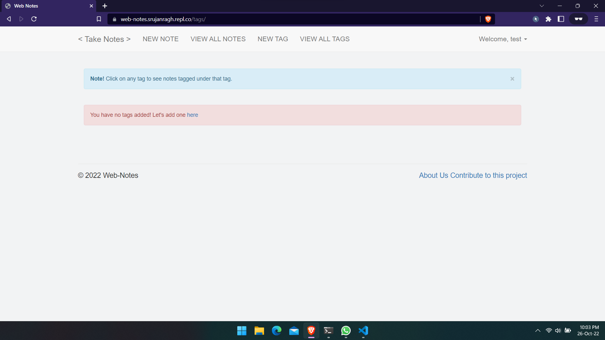
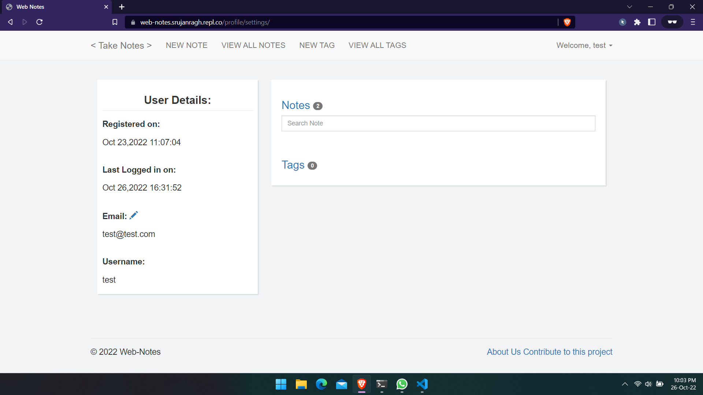

# Web-Notes
An easy to use and deploy web app built using Flask

Wanna try this app? Visit: [https://web-notes.srujanragh.repl.co/](https://web-notes.srujanragh.repl.co/)

# Features:

* Simple Web application, easy to use and *very* easy to deploy locally
* Written in simple Python. Even a beginner Python developer can contribute to this
* Support for SQLite, so you can easily play with it

# Requirements:

Execute the following command to install the required third party libraries: 

`pip3 install -r requirements.txt`

# Usage:
Clone this repository:

`git clone https://github.com/raghavasrujan/Web-Notes.git`

Install the dependencies by simply executing:

`pip3 install -r requirements.txt`

Run this command to start the app:

`python3 manage.py`

Visit `localhost:5000` on your web browser

Happy Noting :)

Built with ♥ and ☕

# Results
## Home Page
Simple interface with login and number of users registered

## Creating a new note
Simple interface with live preview and markdown support

## Viewing a note
Edit box provided to simply edit the note

## Adding a tag

## Viewing all tags
You can click on any tag to see all notes tagged under *that* tag

## Profile Settings
Profile settings to see user details, change email and see notes and tags saved by particular user

